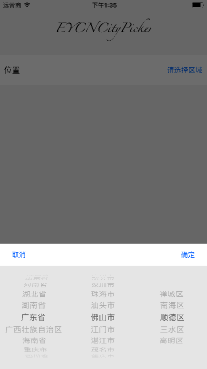

# EYCNCityPicker
iOS城市选择器，行政区域来源于高德web API。



## 安装依赖

### Cocoapods

在 `Podfile` 文件中增加如下行

```ruby
pod 'EYCNCityPicker'
```

运行:

```sh
pod install
```

### 使用方法

```objc
    /// picker中元素的样式
    NSDictionary *attr = @{NSForegroundColorAttributeName: [UIColor darkGrayColor],
                           NSFontAttributeName: [UIFont systemFontOfSize:16]};
    
    /// 初始选择
    NSArray *selections = @[@(_selectProvinceIdx), @(_selectCityIdx), @(_selectDistrictIdx)];
    
    /// 构建一个picker
    EYCNCityPicker *picker = [EYCNCityPicker buildPicker];
    
    /// 显示picker
    [picker
     showInView:self.view
     withData:self.data
     initialSelctions:selections
     itemAttributes:attr
     cancel:^(EYCNCityPicker *picker) {
         // 用户取消选择
         NSLog(@"User canceled");
         [self.selectButton setTitle:@"未选择" forState:UIControlStateNormal];
     } confirmBlock:^(EYCNCityPicker * _Nonnull picker, NSInteger selectedProvinceIdx, NSInteger selectedCityIdx, NSInteger selectedDistrictIdx, NSString * _Nullable selectProvince, NSString * _Nullable selectCity, NSString * _Nullable selectDistrict) {
         // 用户选择了某个行政区域
         self.selectProvinceValue = selectProvince;
         self.selectCityValue = selectCity == nil ? @"" : selectCity;
         self.selectDistrictValue = selectDistrict == nil ? @"" : selectDistrict;
         
         self.selectProvinceIdx = selectedProvinceIdx;
         self.selectCityIdx = selectedCityIdx;
         self.selectDistrictIdx = selectedDistrictIdx;
         
         NSString *selection = [NSString stringWithFormat:@"%@, %@, %@", _selectProvinceValue, _selectCityValue, _selectDistrictValue];
         [self.selectButton setTitle:selection forState:UIControlStateNormal];
     }];
```

更多使用例子，请查看`EYCNCityPickerExample`
